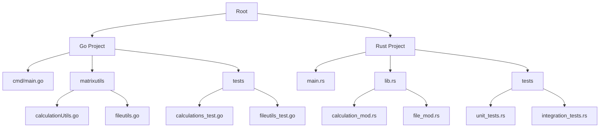
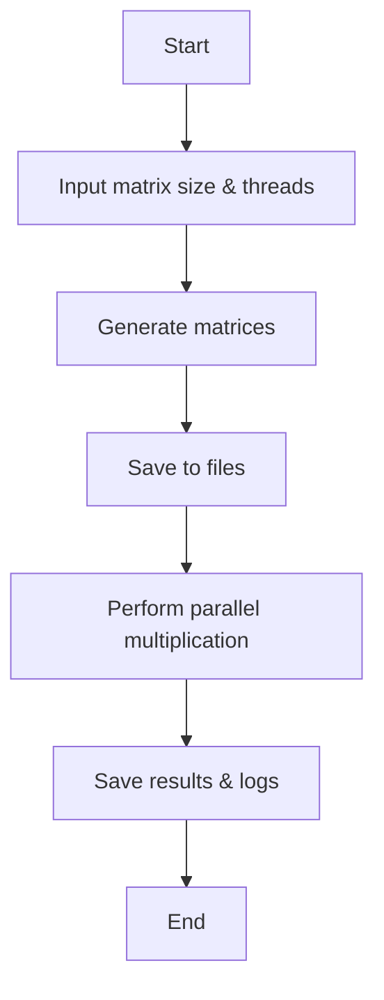
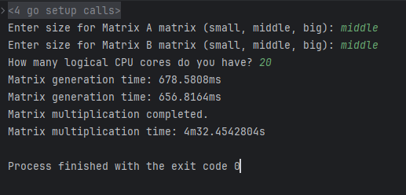

# Parallel Matrix Multiplication in Go and Rust

This project demonstrates parallel matrix multiplication implemented in both Go and Rust. The primary focus is on comparing the concurrency and parallel programming features of these languages rather than optimizing mathematical algorithms.

## How to Run the Project

### Go Project
1. **Generate Matrices**:
   ```sh
   cd go
   go run cmd/main.go
   ```

2. **Run Tests**:
   ```sh
   cd go
   go test ./...
   ```

### Rust Project
1. **Generate Matrices**:
   ```sh
   cd rust
   cargo run --release
   ```

2. **Run Tests**:
   ```sh
   cd rust
   cargo test
   ```

## Similarities Between Go and Rust Projects
Both implementations:
- Use parallelism to enhance matrix multiplication performance.
- Read and write matrices to files in a `generated` folder.
- Log computation performance metrics.
- Support customizable thread or worker counts to optimize CPU utilization.

## Project Structure

The project is organized into Go and Rust directories with the following structure:

### Go Directory
- `cmd/`: Contains the main entry point.
- `matrixutils/`: Handles matrix operations, file I/O, and logging.
- `tests/`: Contains unit tests.

### Rust Directory
- `src/main.rs`: Entry point for the Rust program.
- `mods/file_mod.rs`: Generates matrix and necessary folders.
- `mods/calculation_mod.rs`: Calculate and generate the result matrix.
- `tests/`: Contains unit tests and integration test.

### Diagram



## Program Flow
Both implementations follow a similar flow to perform parallel matrix multiplication.
The general flow of the program is:

1. User specifies matrix dimensions and thread/worker count.
2. Matrices are generated and stored in the `generated/resources` folder.
3. Parallel matrix multiplication is performed.
4. Results and logs are stored in the `generated/log` folder.


### Flowchart


The program generates random matrices, performs parallel matrix multiplication, and logs the computation time.

The terminal output displays the matrix dimensions, the number of worker threads, and the computation time. It should be like below after a successful run: 



## Comparison of Parallelization Features in Rust and Go
Beside the similarities, there are some differences between the two implementations. 
Rust and Go have distinct concurrency models and performance characteristics that influence their suitability for parallel programming tasks.
With Rust, developers must navigate the complexities of ownership and borrowing to ensure thread safety, while Go offers a simpler, goroutine-based approach to parallelism.
Go's garbage collection and lightweight goroutines make it easy to write concurrent code, but Rust's zero-cost abstractions and strict safety guarantees provide a more robust foundation for high-performance applications.

Here is a comparison of the parallelization features in Rust and Go:

| Feature                  | Rust                                  | Go                                  |
|--------------------------|---------------------------------------|-------------------------------------|
| **Concurrency Model**    | Uses `crossbeam`, `mpsc` channels, and scoped threads for concurrency. These features enforce strict thread safety through Rust's ownership model. | Employs goroutines, channels, and the `sync` package to handle parallelism and shared data. |
| **Implementation Complexity** | Moderate to High: Requires detailed understanding of Rust's ownership model and borrowing rules to avoid data races. | Low: Goroutines and channels are simple to use and require minimal setup for basic concurrency. |
| **Performance**          | High: Rust's zero-cost abstractions ensure that parallel operations are efficient. `crossbeam` allows fine-grained control over thread lifecycle and communication. Implementing with `Mutex` can cause significant performance issues due to contention overhead. | Moderate to High: Goroutines are lightweight and can scale well, but performance can degrade due to garbage collection overhead for high concurrency workloads. |
| **Error Handling**       | Compile-time checks prevent data races and ensure safe concurrent code. Errors are caught early. | Runtime panics can occur if channels are misused, and managing goroutines manually may lead to leaks. |
| **Learning Curve**       | Steep: Requires a strong understanding of Rust's strict safety features and ecosystem tools like `crossbeam`. | Gentle: Familiarity with Go's simple syntax and libraries suffices for implementing parallelism. |
| **Suitability**          | Ideal for high-performance, memory-safe applications requiring fine-grained control over threads and memory. | Suitable for quick development of scalable concurrent programs with minimal boilerplate. |

## Generated Folder

The `generated` folder contains:
- `resources/`: Matrix files created during program execution.
- `log/`: Logs detailing computation times and performance.

These files can be deleted after each run.

## Side effects of the Program

### Logging: 
If you run the program multiple times, the `generated` folder will not accumulate matrix files and logs. The program will overwrite existing files with new data! 
This is to prevent the folder from growing too large and to keep the data fresh.

### Performance Metrics:
The program logs the computation time for each run. This data can be used to analyze the performance of the parallel matrix multiplication algorithm.

### Matrix Files:
The program generates matrix files in the `generated/resources` folder. These files are used to store the matrices and read them back for multiplication.

### Thread Utilization:
The program optimizes the number of worker threads based on the system's capabilities and matrix size. This ensures that the system's resources are utilized efficiently.
If you run the program on a system with multiple CPU cores, you will see a significant improvement in performance due to parallelism. 
But if you use your whole cores of CPU for the program it might slow down the performance of the other program or even cause the system to freeze for a calculating time.

### Bigsize Matrices:
- If you use a big size matrix for the calculation, the program might take a long time to calculate the result. Please be patient and let the program finish the calculation.
- The program will generate big size matrices. These are almost 300 MB. So, please make sure you have enough space on your disk.

### Thread Utilization Example


The program allows users to optimize the number of worker threads based on the system's capabilities and the size of the matrices. So that every single calculationsunit of the computer is used to its full potential and provides the best performance possible.

## Troubleshooting

### Common Issues

1. **Dependencies Not Installed**:
   Ensure all required dependencies for Go and Rust projects are installed. For Go, run `go mod tidy`. For Rust, ensure you have installed the latest version of `cargo` and `rustc`.

2. **Insufficient System Resources**:
   Running with too many threads on a system with limited CPU cores may degrade performance. Adjust the worker/thread count accordingly.

3. **File Permissions**:
   Make sure the program has read/write access to the `generated` folder.

4. **Compilation Errors**:
   Ensure the correct version of Go (1.16+) and Rust (1.60+) are installed.

5. **Unexpected Output**:
   Verify the input matrix dimensions and the worker count for consistency.

### Contact
For additional help, please refer to the [Issues section on GitHub](https://github.com/Batman089/rust-go-matrix-parallel-calc/issues) or open a new ticket.

### Summary
- **Rust** excels in performance and safety, making it suitable for applications where control and reliability are paramount.
- **Go** prioritizes simplicity and developer productivity, ideal for projects requiring rapid development of scalable solutions.

## Additional Information

For detailed information, see the individual `README.md` files:
- [Go Project](go/README.md)
- [Rust Project](rust/README.md)

## References

- [Go Documentation](https://golang.org/doc/)
- [Concurrency in Go](https://golang.org/doc/effective_go#concurrency)
- [Rust Documentation](https://doc.rust-lang.org/)
- [Rayon Crate](https://docs.rs/rayon/latest/rayon/)
- [Concurrency in Rust](https://rust-lang.github.io/async-book/)

