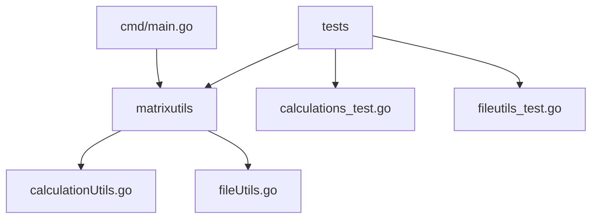

# Go Parallel Matrix Multiplication

This program demonstrates parallel matrix multiplication using Go. It generates matrices, performs multiplication in parallel, and logs the computation time.

## How to Run

1. **Generate Matrices**:
   ```sh
   go run cmd/main.go
   ```

2. **Run Tests**:
   ```sh
   go test ./tests
   ```

## Dependencies

- Go 1.16+
- `sync` package for concurrency

## Program Structure

The program consists of the following main components:
- `cmd/main.go`: Entry point for the program.
- `matrixutils`: Contains utility functions for matrix operations and logging.
- `tests`: Contains unit tests for the program.

### Flow of the Program

1. Get matrix sizes and number of workers from the user.
2. Generate matrices and save them to files.
3. Read matrices from files.
4. Perform parallel matrix multiplication.
5. Log the computation time.


### Diagram



## Parallel Principle in Go

The `performParallelMultiplication` function in `calculationUtils.go` uses several Go features to achieve parallelism and ensure efficient computation. These features include goroutines, channels, and the `sync` package.

### Key Features

1. **Goroutines**: Goroutines are lightweight threads managed by the Go runtime. They allow concurrent execution of functions.
2. **Channels**: Channels provide a way for goroutines to communicate with each other and synchronize their execution.
3. **Sync Package**: The `sync` package provides synchronization primitives such as `WaitGroup` to wait for a collection of goroutines to finish executing.

### Thread Safety and Parallelization

Go's concurrency model, based on goroutines and channels, ensures safe and efficient parallel execution. The `sync` package further enhances this by providing tools to synchronize goroutines.

### `performParallelMultiplication` Function

```go
func performParallelMultiplication(matrixA [][]int, matrixB [][]int, numWorkers int, result [][]int) {
    var wg sync.WaitGroup
    rowChannel := make(chan int, len(matrixA))

    // Launch goroutines to perform matrix multiplication in parallel
    for i := 0; i < numWorkers; i++ {
        wg.Add(1)
        go func() {
            defer wg.Done()
            for row := range rowChannel {
                for col := 0; col < len(matrixB[0]); col++ {
                    for k := 0; k < len(matrixB); k++ {
                        result[row][col] += matrixA[row][k] * matrixB[k][col]
                    }
                }
            }
        }()
    }

    // Send row indices to the channel
    for row := 0; row < len(matrixA); row++ {
        rowChannel <- row
    }
    close(rowChannel)

    // Wait for all goroutines to finish
    wg.Wait()
}
```

### Explanation

1. **Channel Creation**: The function creates a channel (`rowChannel`) to communicate the row indices to be processed by each goroutine.
2. **Goroutine Launching**: Multiple goroutines are launched to process the rows concurrently. Each goroutine receives a row index from the channel, computes the corresponding row of the result matrix, and sends the result back to the main goroutine.
3. **Row Index Distribution**: The main goroutine sends row indices to the channel and waits for the results to be computed by the worker goroutines.
4. **Synchronization**: The `WaitGroup` is used to wait for all goroutines to finish their execution before returning the result matrix.

This parallel approach leverages Go's concurrency model to efficiently perform matrix multiplication, reducing computation time and improving performance.

The program allows users to optimize the number of worker threads based on the system's capabilities and the size of the matrices.
So that every single calculationsunit of the computer is used to its full potential and provides the best performance possible.


## Performance Benchmark

The program includes a benchmarking feature to compare the performance of different worker counts. It measures the computation time for matrix multiplication using different numbers of goroutines.

### Benchmark Results

The benchmark results show that the computation time decreases as the number of workers increases, up to a certain point. Beyond that point, the overhead of managing goroutines outweighs the benefits of parallelism.

The optimal number of workers depends on the matrix size and the system's hardware capabilities. After each successful run, the program logs the computation time for each worker count, allowing users to analyze the performance and choose the optimal configuration. These results can be used to fine-tune the program for specific use cases. These are accessible in the `go/generated/log` directory.

## Generated Folder

The `generated` folder contains the following:
- `resources`: Stores generated matrix files.
- `log`: Stores log files for matrix generation and computation.

After each run, new files are created in the `generated` folder, which can be deleted.

## References

- [Go Documentation](https://golang.org/doc/)
- [Concurrency in Go](https://golang.org/doc/effective_go#concurrency)
