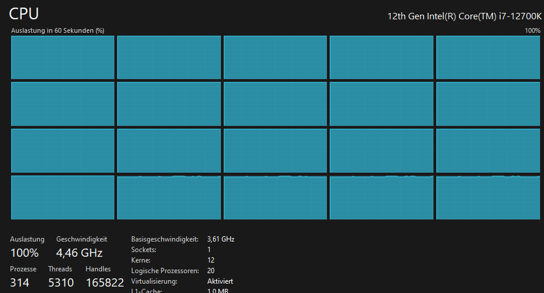

# Rust Parallel Matrix Multiplication

This project implements parallel matrix multiplication in Rust. It includes an enhanced version of the algorithm that resolves issues from previous iterations and provides efficient, concurrent computation.

## How to Run

1. **Generate Matrices**:
   ```sh
   cargo run --release
   ```

2. **Run Tests**:
   ```sh
   cargo test
   ```

## Dependencies

- Rust 1.60+
- `rayon` crate for parallelism
- `serde` and `serde_json` crates for matrix file handling
- `log` and `env_logger` crates for logging

## Program Structure

The project is organized into the following key components:

- `src/main.rs`: Entry point for the program.
- `matrix_utils.rs`: Contains matrix generation and manipulation utilities.
- `parallel.rs`: Implements the parallel multiplication logic.
- `scratch.rs`: A legacy implementation of the multiplication logic.
- `tests`: Unit tests for the matrix and multiplication logic.

### Flow of the Program

1. User specifies the matrix dimensions and worker threads.
2. Matrices are generated and stored in the `generated/resources` folder.
3. Matrices are read back into memory.
4. Parallel multiplication is performed.
5. Results and logs are stored in the `generated/log` folder.


### Diagram


## Parallel Principle in Rust

The `perform_parallel_multiplication` function uses several Rust features to achieve parallelism and ensure thread safety. These features include the `crossbeam` crate, channels, and scoped threads.

### Key Features

1. **Crossbeam Crate**: The `crossbeam` crate provides tools for concurrent programming, including scoped threads which allow for safe and efficient thread management.
2. **Channels**: Rust's `mpsc` (multi-producer, single-consumer) channels are used for communication between threads. They allow threads to send and receive messages safely.
3. **Scoped Threads**: Scoped threads ensure that all threads are joined before the scope exits, preventing data races and ensuring thread safety.

### Thread Safety and Parallelization

Rust's ownership model and type system enforce thread safety by default. The `crossbeam` crate's scoped threads and channels further enhance this by providing safe abstractions for concurrent programming.

### `perform_parallel_multiplication` Function

```rust
fn perform_parallel_multiplication(matrix_a: &[Vec<i32>], matrix_b: &[Vec<i32>], num_workers: usize) -> Vec<Vec<i32>> {
    let (tx, rx) = mpsc::channel();
    let chunk_size = (matrix_a.len() + num_workers - 1) / num_workers;
    crossbeam::scope(|s| {
        for i in 0..num_workers {
            let tx = tx.clone();
            let matrix_a = &matrix_a;
            let matrix_b = &matrix_b;
            s.spawn(move |_| {
                let start_row = i * chunk_size;
                let end_row = (start_row + chunk_size).min(matrix_a.len());
                let mut partial_result = vec![vec![0; matrix_b[0].len()]; end_row - start_row];

                for row in start_row..end_row {
                    for col in 0..matrix_b[0].len() {
                        for k in 0..matrix_b.len() {
                            partial_result[row - start_row][col] += matrix_a[row][k] * matrix_b[k][col];
                        }
                    }
                }
                tx.send((start_row, partial_result)).expect("Failed to send partial result");
            });
        }
    }).unwrap();

    drop(tx);
    let mut result = vec![vec![0; matrix_b[0].len()]; matrix_a.len()];
    for (start_row, partial_result) in rx {
        for (i, row) in partial_result.into_iter().enumerate() {
            result[start_row + i] = row;
        }
    }
    result
}
```

### Explanation

1. **Channel Creation**: The function creates a channel (`mpsc::channel`) to communicate between threads.
2. **Chunk Size Calculation**: The matrix is divided into chunks, each processed by a separate thread.
3. **Thread Spawning**: Using `crossbeam::scope`, multiple threads are spawned. Each thread processes a subset of rows from the input matrices.
4. **Partial Result Calculation**: Each thread calculates a partial result for its assigned rows and sends the result back through the channel.
5. **Result Aggregation**: The main thread collects the partial results from the channel and assembles the final result matrix.

### Thread Safety

- **Ownership and Borrowing**: Rust's ownership model ensures that data is safely shared between threads without data races.
- **Scoped Threads**: Scoped threads from the `crossbeam` crate ensure that all threads are joined before the scope exits, preventing dangling references.
- **Channels**: Channels provide a safe way to communicate between threads, ensuring that data is transferred without conflicts.

This parallel approach leverages Rust's concurrency model to efficiently perform matrix multiplication, reducing computation time and improving performance.

The program allows users to optimize the number of worker threads based on the system's capabilities and the size of the matrices. 
So that every single calculationsunit of the computer is used to its full potential and provides the best performance possible.



## Performance Analysis

The program includes a benchmarking feature to compare the performance of different worker counts. It measures the computation time for matrix multiplication using different numbers of goroutines.

### Benchmark Results

The benchmark results show that the computation time decreases as the number of workers increases, up to a certain point. Beyond that point, the overhead of managing goroutines outweighs the benefits of parallelism.

The optimal number of workers depends on the matrix size and the system's hardware capabilities. After each successful run, the program logs the computation time for each worker count, allowing users to analyze the performance and choose the optimal configuration. These results can be used to fine-tune the program for specific use cases. These are accessible in the `rust/generated/log` directory.

### Generated Folder

The `generated` folder contains dynamically created files:
- `resources`: Stores the matrix files generated during runtime.
- `log`: Stores performance and debugging logs.

After each execution, these files can be safely deleted to free up space.


## References

- [Rust Documentation](https://doc.rust-lang.org/)
- [Rayon Crate](https://docs.rs/rayon/latest/rayon/)
- [Concurrency in Rust](https://rust-lang.github.io/async-book/)

---
This README highlights the program's structure, features, and the advancements over previous implementations. For more details, refer to the source code and inline comments.
```